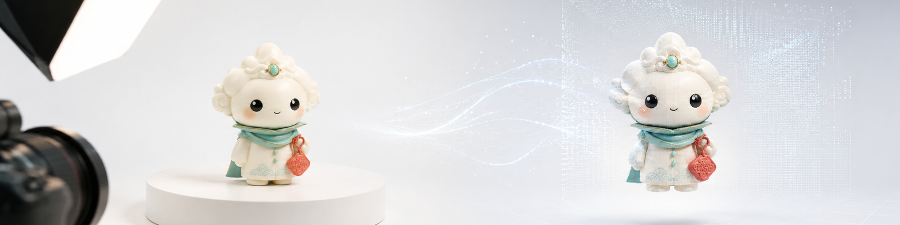
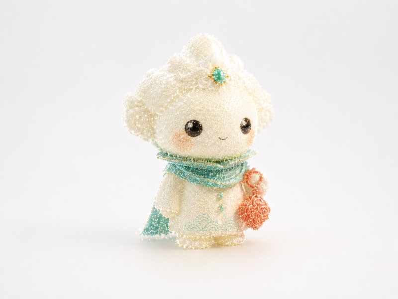
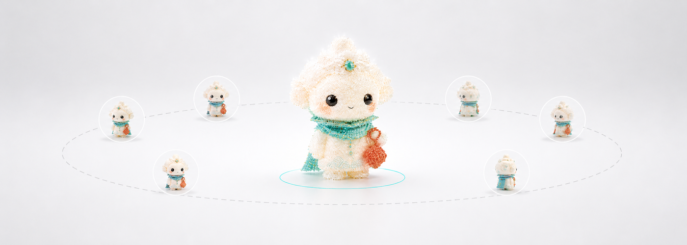
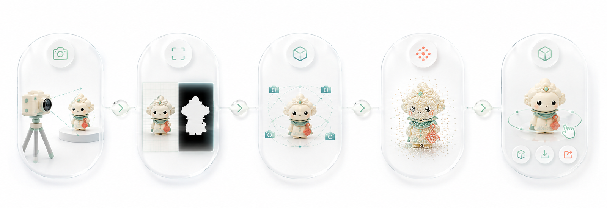
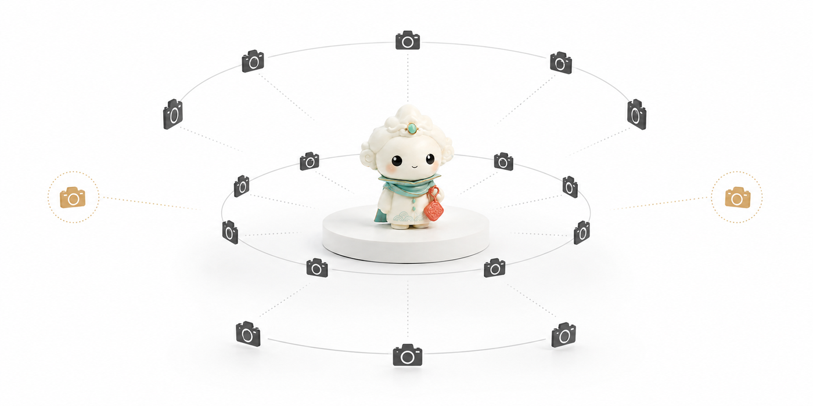

<div align="center">

<!-- Banner Placeholder / 横幅占位符 -->


# 🔮 CraftSplat-20

### *20 张以内文创手办 3D Gaussian Splatting 建模工具链*

### *Few-shot 3DGS toolchain for cultural-creative figurines — under 20 photos*

[](https://opensource.org/licenses/MIT)
[](https://www.python.org/downloads/)
[](https://developer.nvidia.com/cuda-toolkit)
[](https://github.com/Laityperfect7/CraftSplat-20/actions/workflows/ci.yml)
[](https://repo-sam.inria.fr/fungraph/3d-gaussian-splatting/)

**简体中文** | [English](#english)

</div>

---

## 📖 一句话介绍

**CraftSplat-20** 是一个面向文创产品、手办、小摆件的 **少图 3D Gaussian Splatting 建模工具链**——在理想拍摄条件下，仅需 **20 张以内照片** 即可完成高保真可交互视觉复刻。

<div align="center">

&nbsp;→&nbsp;

&nbsp;→&nbsp;

<br/>
<em>示例：手办照片（左）→ 3D Gaussian Splatting 重建（中）→ 交互式环绕视角（右）</em>
<br/>
<em>Demo: Figurine input (left) → 3DGS reconstruction (center) → Interactive orbit view (right)</em>

> ⚠️ 以上为示意占位图 (illustrative placeholders)，用于文档展示。真实重建效果取决于拍摄质量和训练配置，可替换为你的实际结果。
> ⚠️ Above images are illustrative placeholders for documentation. Replace with real reconstruction results if available.

</div>

---

## ✨ 为什么选择 CraftSplat-20？

### 文创产品建模的痛点

| 传统方案 | 痛点 |
|----------|------|
| 摄影测量 (Photogrammetry) | 需要 50-200 张照片，耗时且繁琐 |
| 激光扫描 | 设备昂贵（数万至数十万元） |
| 手动 3D 建模 | 需要专业技能，一个手办需数小时 |
| NeRF | 渲染慢，不支持实时交互 |

### CraftSplat-20 的优势

- **📸 少图**: 18+2 张拍摄协议，10 分钟拍完
- **⚡ 实时**: 训练后 60+ FPS 交互式渲染
- **🎯 定制**: 针对小物体（5-30cm）优化的参数配置
- **🆓 开源**: MIT 协议，完全免费
- **🔧 模块化**: CLI 工具链，每步独立可替换
- **📦 多格式导出**: PLY / Splat / KSplat / GLB（beta）

---

## 🗺️ 技术路线

<div align="center">

</div>

```
┌─────────────────────────────────────────────────────────┐
│                  CraftSplat-20 技术路线                    │
├─────────────────────────────────────────────────────────┤
│                                                         │
│   📸 照片采集 ──▶ 🔧 预处理 ──▶ 📐 COLMAP SfM            │
│      18+2           排序         特征提取+匹配             │
│      环绕拍摄       Resize       稀疏重建+位姿             │
│                     Mask                                 │
│                                                         │
│   📐 COLMAP ──▶ 🚀 Nerfstudio 训练 ──▶ 📦 导出           │
│    位姿+点云      Splatfacto (gsplat)    PLY/Splat       │
│                   L1+SSIM Loss          KSplat/GLB(beta) │
│                   自适应密度控制                          │
│                                                         │
│   📦 导出 ──▶ 🌐 Web 展示                                │
│                SuperSplat / GaussianSplats3D             │
│                / CraftSplat-20 Viewer (beta)             │
│                                                         │
├─────────────────────────────────────────────────────────┤
│  🔧 可选增强:                                            │
│  • FSGS / SparseGS — 少图质量增强                        │
│  • SuGaR / 2DGS / GS2Mesh — mesh 提取 (beta)            │
│  • Depth Anything V2 — 单目深度先验                      │
│  • AprilTag / 棋盘格 — 物理尺度标定                      │
└─────────────────────────────────────────────────────────┘
```

| 组件 | 默认方法 | 替代方案 |
|------|----------|----------|
| **训练后端** | Nerfstudio Splatfacto + gsplat | 原版 3DGS (graphdeco-inria) |
| **少图增强** | — (可选) | FSGS, SparseGS |
| **位姿估计** | COLMAP (SfM) | 手动标定, AprilTag |
| **Mesh 导出 (beta)** | — (可选) | SuGaR, 2DGS, GS2Mesh |
| **Web 展示** | SuperSplat | GaussianSplats3D, CraftSplat-20 Viewer |
| **Mask 生成** | rembg (可选) | SAM, manual matting |

---

## 📑 目录

- [快速开始](#-快速开始)
- [安装](#-安装)
- [CLI 命令详解](#-cli-命令详解)
- [18+2 拍摄协议](#-182-拍摄协议)
- [输入输出格式](#-输入输出格式)
- [适用场景与限制](#-适用场景与限制)
- [项目结构](#-项目结构)
- [GPU 要求](#-gpu-要求)
- [Roadmap](#-roadmap)
- [FAQ](#-faq)
- [Citation / 致谢](#-citation--致谢)
- [License / 许可证](#-license--许可证)

---

## ⚡ 快速开始

### 一键流水线

```bash
# 1. 拍摄 18+2 张照片，放入 input_photos/ 目录
#    详见 docs/capture_guide_zh.md

# 2. 生成拍摄计划
craftsplat capture-plan --photos 20 --rings "8,6,4" --eval 2

# 3. 预处理
craftsplat prepare input_photos/ output_dir/ \
  --max-photos 20 --resize 1600 --mask rembg

# 4. COLMAP 位姿估计
craftsplat colmap output_dir/ --matcher exhaustive

# 5. 训练
craftsplat train output_dir/ --method splatfacto --steps 15000

# 6. 导出
craftsplat export output_dir/ --formats ply,splat

# 7. 生成报告
craftsplat report output_dir/

# 8. 展示：将 .splat 文件拖入 https://playcanvas.com/supersplat
```

**或使用一键脚本**:

```bash
python scripts/run_pipeline.py input_photos/ --output my_run --skip-colmap
```

---

## 📥 安装

### 本项目

```bash
git clone https://github.com/Laityperfect7/CraftSplat-20.git
cd CraftSplat-20
pip install -e .
```

安装后验证：

```bash
craftsplat --help
craftsplat capture-plan --help
```

### 上游依赖（需单独安装）

CraftSplat-20 **不捆绑**上游工具，需要你手动安装训练所需的外部依赖：

| 工具 | 用途 | 安装命令 |
|------|------|----------|
| **COLMAP** | 相机位姿估计 | [colmap.github.io](https://colmap.github.io/install.html) 或 `conda install -c conda-forge colmap` |
| **Nerfstudio** | 3DGS 训练框架 | `pip install nerfstudio` |
| **gsplat** | 3DGS 光栅化后端 | 随 Nerfstudio 自动安装 |
| **rembg** (可选) | 背景移除 | `pip install rembg` |
| **SuGaR** (可选) | mesh 提取 | [github.com/Anttwo/SuGaR](https://github.com/Anttwo/SuGaR) |
| **2DGS** (可选) | mesh 提取替代 | [github.com/hbb1/2d-gaussian-splatting](https://github.com/hbb1/2d-gaussian-splatting) |

> ⚠️ **重要**: 如果运行 `craftsplat colmap` 或 `craftsplat train` 时缺少外部依赖，CLI 会给出**清晰的报错信息**和**安装链接**，不会崩溃。

---

## 🔧 CLI 命令详解

### `craftsplat capture-plan`

生成 18+2 拍摄角度表。

```bash
craftsplat capture-plan --photos 20 --rings "8,6,4" --eval 2 -o plan.json
```

| 参数 | 默认值 | 说明 |
|------|--------|------|
| `--photos` | 20 | 总照片数 |
| `--rings` | "8,6,4" | 各环照片数（上/中/下） |
| `--eval` | 2 | 校准视角数量 |
| `-o` | capture_plan.json | 输出 JSON 路径 |

### `craftsplat prepare`

图片预处理。

```bash
craftsplat prepare INPUT_DIR OUTPUT_DIR \
  --max-photos 20 --resize 1600 --mask rembg
```

| 参数 | 默认值 | 说明 |
|------|--------|------|
| `--max-photos` | 20 | 最大处理张数 |
| `--resize` | 1600 | 长边像素，0=不缩放 |
| `--mask` | none | none / rembg / colmap |

### `craftsplat colmap`

COLMAP 稀疏重建 wrapper。

```bash
craftsplat colmap OUTPUT_DIR --matcher exhaustive --use-masks
```

### `craftsplat train`

Nerfstudio 训练 wrapper。

```bash
craftsplat train OUTPUT_DIR --method splatfacto --steps 15000
```

### `craftsplat export`

导出模型。

```bash
craftsplat export RUN_DIR --formats ply,splat,ksplat,glb
```

### `craftsplat report`

生成运行报告。

```bash
craftsplat report RUN_DIR --eval-dir EVAL_DIR -o report.md
```

---

## 📸 18+2 拍摄协议

<div align="center">

</div>

CraftSplat-20 推荐 **18 张环绕 + 2 张校准** 的拍摄方案：

```
上环 (+30°):  8 张 — 每 45° 一张
中环 (  0°):  6 张 — 每 60° 一张，与上环错开 15°
下环 (-20°):  4 张 — 每 90° 一张，与中环错开 15°
校准 (+55°):   2 张 — 顶部视角，不参与训练
────────────────────────────
合计: 20 张
```

**拍摄要点**:
- 📷 手动曝光 + 固定白平衡
- 💡 柔光均匀照明
- 🔄 使用转盘确保物体姿态一致
- 🎨 纯色背景（灰/白）
- 🚫 不用闪光灯

完整指南: [docs/capture_guide_zh.md](docs/capture_guide_zh.md)

---

## 📁 输入输出格式

### 输入

```
input_photos/
├── IMG_0001.jpg    # 方位 0°,   仰角 +30° (上环)
├── IMG_0002.jpg    # 方位 45°,  仰角 +30°
├── ...
└── IMG_0020.jpg    # 方位 180°, 仰角 +60° (校准)
```

### 预处理后

```
output_dir/
├── images/
│   ├── 001.jpg     # 重命名、缩放后的图片
│   ├── 002.jpg
│   └── ...
├── masks/          # 可选
│   ├── 001_mask.png
│   └── ...
└── manifest.json   # 记录所有处理元数据
```

### 训练后

```
output_dir/
├── runs/
│   └── splatfacto/
│       └── <timestamp>/
│           ├── config.yml
│           ├── checkpoint.pt
│           └── point_cloud.ply
├── exports/
│   ├── point_cloud.ply
│   ├── point_cloud.splat
│   └── GLB_MESH_README.txt  (glb 导出时)
└── report.md
```

---

## ⚠️ 适用场景与限制

### ✅ 适合

- 🎨 哑光/半哑光涂装手办、潮玩、盲盒
- 🏺 有机外形陶瓷、陶器、木雕
- 🧸 布艺手工、毛绒玩具
- 🎓 计算机视觉课程设计/毕业设计
- 🏪 电商 3D 产品展示
- 📱 社交媒体 AR 滤镜素材

### ❌ 不适合

- 🪞 镜面/镀铬物体（COLMAP 无法匹配特征）
- 🪟 透明玻璃/水晶（折射反射干扰重建）
- 🪡 极细结构（<1mm，低于照片分辨率）
- 🖨️ 直接 3D 打印（需要 mesh 后处理）
- 📐 工业级精密测量

> **诚实声明**:
> - 3DGS 本质上是**基于点的视觉表示**，主要适合**视觉展示**，不保证工业级可打印网格。
> - Mesh 导出为 **Beta 功能**，需要 SuGaR/2DGS/GS2Mesh 等几何方法辅助，且通常需在 Blender 中手动修复。
> - 详细可行性分析: [docs/feasibility.md](docs/feasibility.md)

---

## 📁 项目结构

```
CraftSplat-20/
├── README.md                           # 项目主页（中英双语）
├── LICENSE                             # MIT 许可证
├── CHANGELOG.md                        # 版本历史
├── pyproject.toml                      # 项目元数据
├── requirements.txt                    # Python 依赖
├── .gitignore
│
├── src/craftsplat/                     # 核心 Python 包
│   ├── __init__.py                     #   版本和导出
│   ├── cli.py                          #   CLI 主入口
│   └── commands/                       #   子命令
│       ├── __init__.py
│       ├── capture_plan.py             #     拍摄计划生成
│       ├── prepare.py                  #     图片预处理
│       ├── colmap_cmd.py               #     COLMAP wrapper
│       ├── train_cmd.py                #     训练 wrapper
│       ├── export_cmd.py               #     模型导出
│       └── report.py                   #     报告生成
│
├── scripts/
│   └── run_pipeline.py                 #   一键流水线脚本
│
├── docs/                               # 文档
│   ├── capture_guide_zh.md             #   18+2 拍摄指南
│   ├── feasibility.md                  #   可行性分析
│   ├── pipeline.md                     #   完整技术流程
│   └── troubleshooting.md              #   故障排除
│
├── web-viewer/
│   └── index.html                      #   Web Viewer 占位页面
│
├── examples/                           # 示例目录
│   ├── touch-gallery/
│   │   └── README.md                   #   潮玩手办示例
│   └── handmade-ceramic/
│       └── README.md                   #   手工陶瓷示例
│
├── tests/
│   ├── __init__.py
│   ├── test_cli.py
│   ├── test_capture_plan.py
│   └── test_prepare.py
│
└── .github/workflows/
    └── ci.yml                          #   GitHub Actions CI
```

---

## 💻 GPU 要求

| GPU | VRAM | 支持 | 预期训练时间 |
|-----|------|------|-------------|
| RTX 2060 | 6GB | ⚠️ 降分辨率至 1200px | ~90 分钟 |
| RTX 3060 | 12GB | ✅ | ~60 分钟 |
| RTX 4070 | 12GB | ✅ 推荐 | ~40 分钟 |
| RTX 4090 | 24GB | ✅ 最佳 | ~20 分钟 |
| Apple M1/M2/M3 | 统一内存 | ⚠️ 实验性 (MPS) | 较慢 |
| Intel Mac / 无 GPU | — | ❌ 无法训练 | — |

> 仅运行 `capture-plan`、`prepare`、`report` 命令**不需要 GPU**。

---

## 🗺️ Roadmap

- [x] 模块化 CLI 工具链
- [x] 18+2 拍摄协议
- [x] COLMAP / Nerfstudio wrapper
- [x] 多格式导出（PLY/Splat/KSplat）
- [x] 中英双语文档
- [x] 运行报告自动生成
- [x] Web Viewer 占位页面
- [x] GitHub Actions CI
- [ ] **FSGS adapter 集成** — 少图质量增强
- [ ] **WebGL Web Viewer 完整实现** — 真实渲染能力
- [ ] **SuGaR / 2DGS mesh pipeline** — 一键 mesh 导出
- [ ] **Colab notebook** — 云端免费训练
- [ ] **AprilTag 自动尺度标定**
- [ ] **多物体同时扫描支持**

---

## ❓ FAQ

<details>
<summary><b>为什么只需要 20 张照片？</b></summary>

传统 3DGS 需要 50-200 张照片来覆盖场景的各个角度。但文创手办体积小（5-30cm）、表面纹理通常较丰富，配合合理的环绕角度分布和 Splatfacto 的少图优化，18-20 张即可获得可用的视觉重建。对于纹理极少的物体，可使用 FSGS/SparseGS adapter 增强。
</details>

<details>
<summary><b>为什么没有把 COLMAP/Nerfstudio 代码复制进仓库？</b></summary>

CraftSplat-20 是一个 **工具链**，不是 3DGS 的替代实现。我们通过 subprocess 封装上游工具的 CLI，保持代码库轻量、易维护。上游工具各自独立安装和更新，CraftSplat-20 始终兼容它们的最新版本。
</details>

<details>
<summary><b>mesh 导出的质量如何？</b></summary>

⚠️ **诚实回答**: 从 3DGS 提取 mesh 在 2025 年仍是一个活跃的研究问题。SuGaR/2DGS/GS2Mesh 可以在**视觉上**生成像物体形状的 mesh，但通常不是水密的、不可直接 3D 打印。需要在 Blender/ZBrush 中手动修复（补洞、平滑、重新拓扑）。如果你的目标是 3D 打印，建议使用传统的摄影测量方案。
</details>

<details>
<summary><b>可以用手机拍摄吗？</b></summary>

✅ 完全可以。现代手机主摄（等效 24-28mm）非常适合此任务。建议：
- 使用第三方相机 App 锁定曝光和白平衡
- 开启 RAW 模式（如果支持）
- 使用手机三脚架或稳定器
</details>

<details>
<summary><b>CLI 提示缺少外部依赖怎么办？</b></summary>

CraftSplat-20 不会直接打包 COLMAP 和 Nerfstudio。当你运行 `craftsplat colmap` 或 `craftsplat train` 时，如果检测到依赖缺失，CLI 会输出清晰的安装指南和链接，而不会崩溃。详见 [docs/troubleshooting.md](docs/troubleshooting.md)。
</details>

---

## 📚 Citation / 致谢

### 本项目引用

如果 CraftSplat-20 对你的工作有帮助，请引用原始 3DGS 论文和相关工具：

```bibtex
@article{kerbl2023gaussian,
  title={3D Gaussian Splatting for Real-Time Radiance Field Rendering},
  author={Kerbl, Bernhard and Kopanas, Georgios and Leimk{\"u}hler, Thomas and Drettakis, George},
  journal={ACM Transactions on Graphics},
  volume={42}, number={4}, year={2023}
}

@misc{nerfstudio2023,
  title={Nerfstudio: A Modular Framework for Neural Radiance Field Development},
  author={Tancik, Matthew and Weber, Ethan and Ng, Evonne and Li, Ruilong and Yi, Brent and
          Wang, Terrance and Kristoffersen, Alexander and Austin, Jake and Salahi, Kamyar and
          Ahuja, Abhik and McAllister, David and Kerr, Justin and Kanazawa, Angjoo},
  year={2023}
}

@article{ye2024gsplat,
  title={gsplat: An Open-Source Library for {Gaussian} Splatting},
  author={Ye, Vickie and Li, Ruilong and Kerr, Justin and Turkulainen, Matias and Yi, Brent and
          Pan, Zhuoyang and Seiskari, Otto and Ye, Jianbo and Hu, Jeffrey and Tancik, Matthew and
          Kanazawa, Angjoo},
  journal={arXiv preprint arXiv:2409.06765},
  year={2024}
}
```

### 上游项目许可声明

CraftSplat-20 本身使用 **MIT License**，但你使用本项目时**依赖的上游工具各有其独立的许可证**：

| 上游项目 | 许可证 | 需遵守 |
|----------|--------|--------|
| 3D Gaussian Splatting (graphdeco-inria) | [LICENSE](https://github.com/graphdeco-inria/gaussian-splatting) | 非商业用途限制（请自行核查最新条款） |
| Nerfstudio | Apache 2.0 | 保留版权声明 |
| gsplat | Apache 2.0 | 保留版权声明 |
| COLMAP | BSD 3-Clause | 保留版权声明 |
| SuGaR | MIT | 保留版权声明 |
| 2DGS | [Custom](https://github.com/hbb1/2d-gaussian-splatting) | 请查看其仓库 |
| FSGS | MIT | 保留版权声明 |

> ⚠️ **请仔细阅读各上游项目的许可证**，确保你的使用方式符合其条款。某些项目可能有商业使用限制。

---

<a name="english"></a>

## 🇬🇧 English

**CraftSplat-20** is a few-shot 3D Gaussian Splatting toolchain designed for cultural-creative products, figurines, and small collectibles. Under ideal capture conditions, as few as **18+2 photos** can produce high-fidelity, interactive 3D visualizations.

### Tech Stack

- **Core pipeline**: Nerfstudio Splatfacto + gsplat
- **Reference**: Original 3DGS (graphdeco-inria/gaussian-splatting)
- **Few-shot boosters** (optional): FSGS, SparseGS
- **Mesh export** (beta): SuGaR, 2DGS, GS2Mesh
- **Web viewer**: SuperSplat / GaussianSplats3D

### Quick Start

```bash
craftsplat capture-plan --photos 20 --rings "8,6,4" --eval 2
craftsplat prepare input/ output/ --max-photos 20 --resize 1600
craftsplat colmap output/ --matcher exhaustive
craftsplat train output/ --method splatfacto --steps 15000
craftsplat export output/ --formats ply,splat
craftsplat report output/
```

Full documentation: see Chinese sections above or [docs/](docs/).

---

## 📄 License / 许可证

CraftSplat-20 is licensed under the **MIT License**. See [LICENSE](LICENSE) for the full text.

本项目使用 **MIT 许可证**。完整内容见 [LICENSE](LICENSE)。

> ⚠️ **上游依赖各自的许可证需要单独遵守**。请阅读 [上游项目许可声明](#上游项目许可声明)。

---

<div align="center">

### ⭐ 如果这个项目对你有帮助，请点个 Star！⭐

<br/>

| Gitee | GitHub |
|-------|--------|
| [gitee.com/GM0531/craft-splat-20](https://gitee.com/GM0531/craft-splat-20) | [github.com/Laityperfect7/CraftSplat-20](https://github.com/Laityperfect7/CraftSplat-20) |

<br/>

*Built with ❤️ for the cultural-creative + 3D vision community.*
<br/>
*为文创 + 三维视觉社区用 ❤️ 构建。*

</div>
